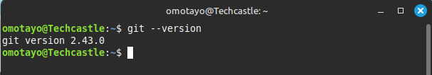
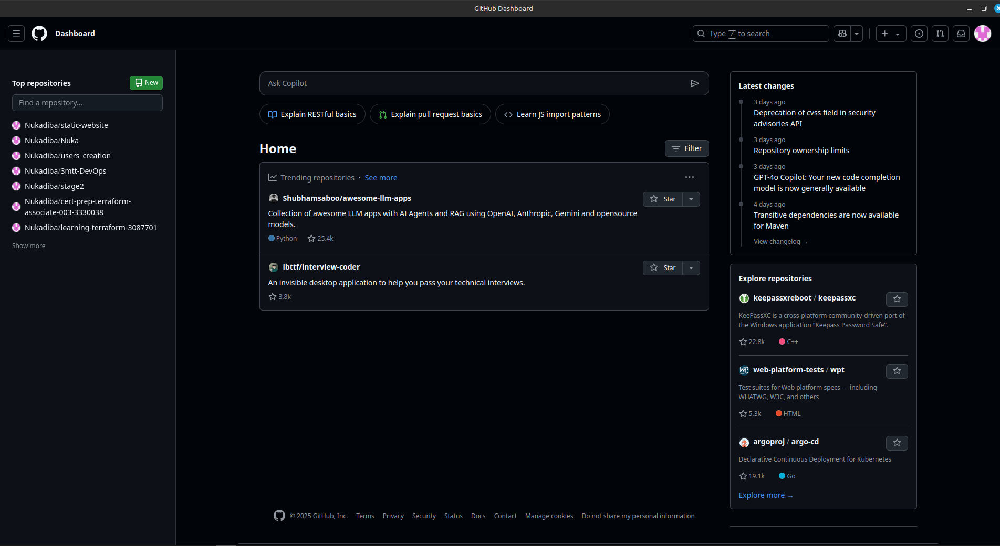
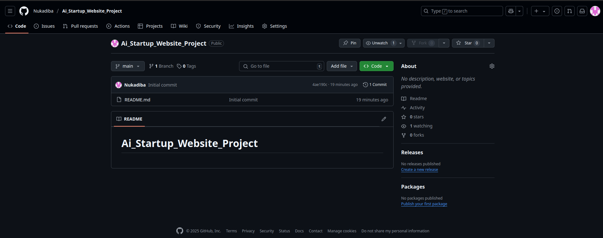
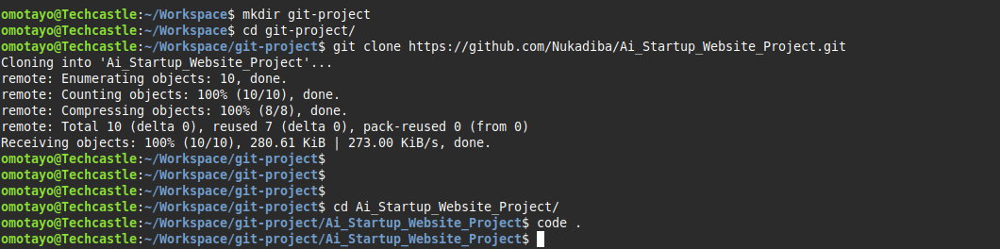
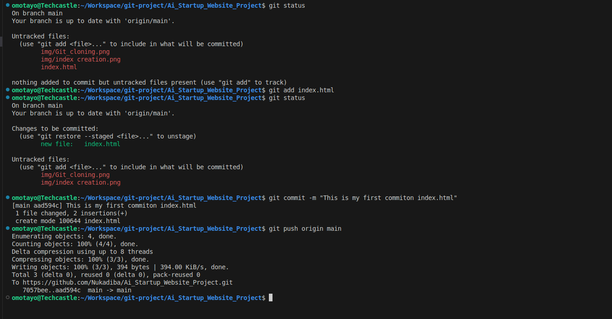
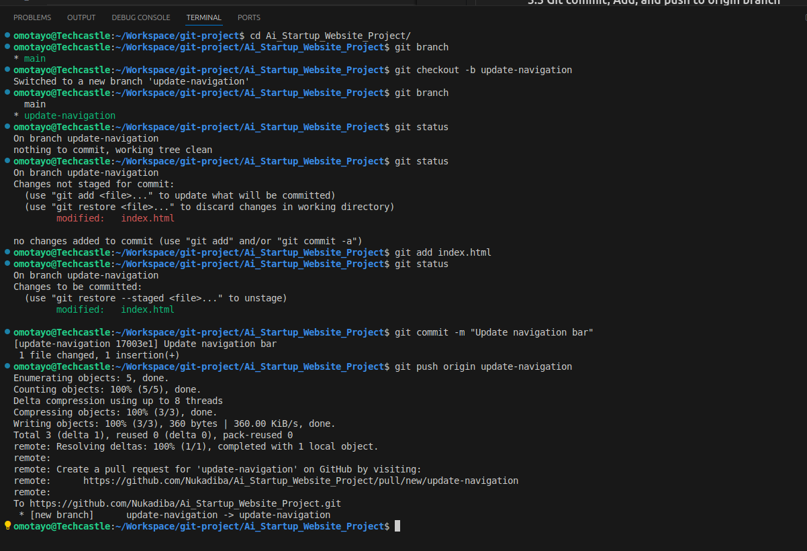

# Ai_Startup_Website_Project

# Part 1: Setup and Initial Configuration 

## 1. Git Download and Installation 

### 1.1 Git Download 

## 2. Github Repository Cretaion 

### 2.1 Github Account Creation 

### 2.2 Github Repository Creation 

## 3. Repository Cloning 

### 3.1 Repository Cloning and navigating into it

### 3.2 Creation of index.html and writing code

### 3.3 Git commit, Add, and push to origin branch 

# Part 2

## Simulating Tom and Jerrys"s Work 

### 1. Cretaing of Tom's Branch and adding some text into the index.html and commiting it and pushing to the origing server 

